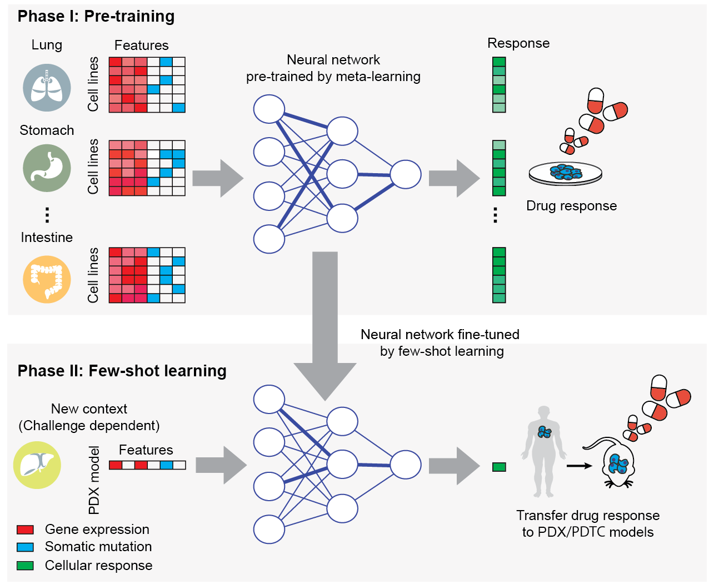

# Introduction

TCRP (Transfer of Cellular Response Prediction) is a few-shot machine learning algorithm to perform transfer learning for drug response predictions in cancer. It is used to train a neural network model using data in one experimental context (e.g. cell lines) that can be readily tuned to new contexts (e.g. patients) using few additional samples. In pilot experiments, the model has been shown to quickly adapt when switching among different tissue types and in moving from cell-line models to clinical contexts, including patient-derived tumor cells and patient-derived xenografts.

**This GitHub repository provides an implementation of TCRP as an easy-to-use Python program.**

# Publication

Jianzhu Ma, Samson H. Fong, Christopher J. Bakkenist, John Paul Shen, Soufiane Mourragui, Lodewyk F. A. Wessels, Marc Hafner, Roded Sharan, Jian Peng, Trey Ideker.  *Learning predictive models of drug response that translate across biological contexts. Nature Cancer* (CITATION TBD).

# Model Access

The model can be downloaded here: https://idekerlab.ucsd.edu/projects/tcrp/tcrp_model.tar.gz

# Model overview


# Directory Structure

*code*: folder containing Python code for both neural network training and prediction.
*data*: Training and testing data. We include the training data for the drug Sorafenib as an example.

# Dependencies

The code is developed under Python 2.7 and PyTorch 0.4.1.post2. See [here](https://pytorch.org/) for installation and basic tutorials. No other dependencies are required.

# Data Preparations

For the pre-training phase, please prepare the feature and label files for each task in the same folder. For the few-shot learning phase, please prepare the feature and label files for the target domain in the same folder used for pre-training. Use the option ‘-feature_dic’ to specify the name of the folder. These names can be changed in the ‘load_data’ and ‘load_data_PDTC’ functions in the util.py file. An example file, ‘Sorafenib_tissue_map.pkl’, is included in the data/ folder. Please use option ‘-tissue_list’ to specify the file to use.
Please also prepare a ‘task list’ file to store the detailed information of each sub-task in the pre-training phase. It is a Python dictionary stored in a pickle file. The key of that dictionary is the name of the sub-task, which should be the same as the feature and label file. For example, if the sub-task is called ‘lung’, then the corresponding feature and label files should be ‘lung_Sorafenib_feature.npy’ and ‘large_Sorafenib_label.npy’, respectively. 

# Demo

## Run Command: 

```python tcrp_train.py --drug Sorafenib --tissue_num 12 --meta_batch_size 10 --meta_lr 0.001 --inner_lr 0.001 --layer 1 --hidden 20 --K 1```

## Output: 

The model trained for each epoch will be saved in the ‘--model_dic’ folder. Please modify the code in line 96 of tcrp_train.py if another location is desired for storing the models.

## Data availability: 

The gene expression and somatic mutation profiles used in the paper for each cell line are from the Cancer Cell Line Encyclopedia (CCLE) project. These data can be downloaded from the DepMap website: http://depmap.org/portal/download/. 
The drug response data used in the paper for each cell line can be downloaded from the GDSC 1000 website: http://www.cancerrxgene.org/gdsc1000/GDSC1000_WebResources/.

Expression data, somatic mutations and drug responses for the analysis of Patient-Derived Tumor Cells (PDTC) reported in the paper can be downloaded from the following URL: http://figshare.com/articles/Bruna_et_al_A_biobank_of_breast_cancer_explants_with_preserved_intra-tumor_heterogeneity_to_screen_anticancer_compounds_Cell_2016/2069274. 

All relevant data for the Patient Derived Xenograft (PDX) models can be extracted from Supplementary Table 1 of the paper ‘High-throughput screening using patient-derived tumor xenografts to predict clinical trial drug response.’

